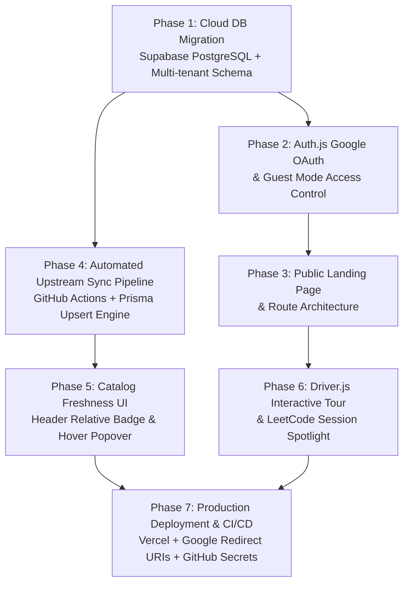

# 🗺️ LeetCode Companion - Architectural Blueprint & Roadmap

This document outlines the end-to-end architecture, technical design decisions, and execution phases based on our discussions. The project transitions from a single-user local tool to a multi-tenant, cloud-powered web platform with authentication, guest exploration, upstream question tracking, and interactive onboarding.

---

## 🏗️ Core Architecture Overview

```
                        ┌──────────────────────────────────────────────┐
                        │              Client Layer (Next.js)          │
                        ├──────────────────────┬───────────────────────┤
                        │   Public Landing (/) │ App Dashboard (/...)  │
                        │   • Hero Showcase    │ • 650+ Companies      │
                        │   • Google Sign-In   │ • Driver.js Tour      │
                        │   • Guest Mode CTA   │ • Catalog Timeline    │
                        └──────────┬───────────┴───────────┬───────────┘
                                   │                       │
                           Guest (Local State)       Auth Session (JWT)
                                   │                       │
                                   ▼                       ▼
                        ┌──────────────────────────────────────────────┐
                        │             Next.js API & Auth.js            │
                        ├──────────────────────────────────────────────┤
                        │  • Auth.js v5 (Google OAuth)                 │
                        │  • Role-gate (Cloud Sync vs Guest)           │
                        │  • LeetCode GraphQL / REST Sync Proxy        │
                        └──────────────────────┬───────────────────────┘
                                               │ (Prisma ORM)
                                               ▼
                        ┌──────────────────────────────────────────────┐
                        │            Supabase (PostgreSQL)             │
                        ├──────────────────────┬───────────────────────┤
                        │   Master Catalog     │      User Domain      │
                        │   • Company          │ • User & Account      │
                        │   • Problem          │ • UserProblemProgress │
                        │   • CompanyProblem   │ • UserSyncConfig      │
                        │   • SyncMetadata     │ • UserStats           │
                        └──────────▲───────────┴───────────────────────┘
                                   │
                           GitHub Actions Cron
                        (Syncs from Upstream Repo)
```

---

## 📋 Implementation Phases

---

### 🟢 Phase 1: Cloud Database Migration (Foundation)
> **Priority:** Critical (Prerequisite for all multi-user and cloud features)

#### Objective
Migrate the persistence layer from the local single-file SQLite database (`dev.db`) to a managed **Supabase (PostgreSQL)** database, restructuring the schema to support multiple users and upstream sync tracking.

#### Technical Specifications & Schema Changes
1. **Database Setup**:
   * Create a Supabase PostgreSQL instance and configure connection pooling (`DATABASE_URL` and direct `DIRECT_URL`).
   * Switch Prisma provider in `prisma/schema.prisma` from `sqlite` to `postgresql`.
2. **Schema Restructuring**:
   * **Decouple Master Catalog from User State**:
     * `Problem`: Keep only catalog fields (`id`, `title`, `url`, `titleSlug`, `difficulty`, `acceptance`). Remove user-specific flags (`solved`, `notes`, `bookmarked`).
     * `Company` & `CompanyProblem`: Retain Many-to-Many relationship with frequency and recency flags (`inThirtyDays`, `inThreeMonths`, etc.).
   * **New User Progress Table (`UserProblemProgress`)**:
     * Relates `userId` to `problemId`.
     * Tracks per-user `solved` (boolean), `solvedAt` (timestamp), `notes` (text), and `bookmarked` (boolean).
   * **New Catalog Sync Metadata Table (`SyncMetadata`)**:
     * Tracks upstream repo synchronization runs: `commitSha`, `syncedAt`, `updatedCompanySlugs`, `problemsAddedCount`.
     * Stores per-company `lastUpdated` timestamps for catalog freshness indicators.
3. **Data Seeding**:
   * Update `prisma/seed.ts` to use non-destructive `upsert` queries to batch-load the 650+ companies and problems into Supabase without blowing away user records.

---

### 🔵 Phase 2: Authentication & Guest Mode Access Control
> **Priority:** High (Enables user accounts, persistent multi-device data, and security)

#### Objective
Implement authentication using **Auth.js v5 (NextAuth)** with Google OAuth, while providing a seamless **Guest Mode ("Continue as Guest")** for visitors who want to browse and try the app without logging in.

#### Technical Specifications
1. **Google OAuth with Auth.js (NextAuth v5)**:
   * Install `@auth/prisma-adapter` and `next-auth@beta`.
   * Configure Google Cloud Console credentials (`GOOGLE_CLIENT_ID`, `GOOGLE_CLIENT_SECRET`).
   * Implement Auth handlers: `/api/auth/[...nextauth]`.
   * Persist user profiles, accounts, and session tokens directly in Supabase.
2. **User Experience & Navigation**:
   * Add dynamic User Profile widget in Navbar:
     * **Logged In**: Displays user avatar, display name, and a dropdown menu with "Settings", "Sync LeetCode", and "Logout".
     * **Guest**: Displays "Sign in with Google" button and "Guest Mode" indicator.
3. **Guest Mode Logic ("Continue as Guest")**:
   * Unauthenticated guests have unrestricted access to read:
     * Browse 650+ company interview tracks.
     * Search, filter by difficulty (Easy/Medium/Hard), and filter by recency (30 Days, 3 Months, etc.).
     * Open problem modal, view company frequency %, and view problem descriptions.
   * Guest solved status and bookmarks are saved to browser `localStorage` for immediate convenience.
   * **Protected Cloud Features (Guest Gate)**:
     * If a guest clicks "Sync with LeetCode", attempts to enter a `LEETCODE_SESSION` cookie, or write cloud notes, a sleek modal prompt appears:
       > *"Sign in with Google to enable automatic LeetCode sync, cloud notes, and cross-device streaks."*

---

### 🟣 Phase 3: Public Landing Page & Route Architecture
> **Priority:** High (First impressions, SEO, and clear conversion funnel)

#### Objective
Build a modern, high-converting public landing page at `/` for new and logged-out visitors, while routing authenticated users directly to the application dashboard.

#### Technical Specifications
1. **Route Architecture**:
   * **`/` (Public Landing Page)**: Rendered for guests and first-time visitors. If a valid user session is detected, automatically redirects to `/dashboard`.
   * **`/dashboard` (Main Application)**: The existing company directory, search bar, filters, and global statistics.
2. **Landing Page Design & Components**:
   * **Hero Section**:
     * Headline: *"Master Company-Wise LeetCode Interview Questions"*.
     * Subheadline: *"Real interview questions from 650+ top tech companies, categorized by recency (30 Days to 1 Year) with automated LeetCode progress tracking."*
     * Dual Action CTAs:
       * Primary CTA: **"Sign In with Google"** (with Google icon).
       * Secondary CTA: **"Explore as Guest →"** (routes directly to `/dashboard`).
   * **Interactive Metrics Banner**:
     * Counters: `650+ Companies`, `3,000+ Verified Problems`, `5 Recency Windows`, `100% LeetCode Sync`.
   * **Feature Preview Showcase**:
     * Visual cards highlighting Company Tracks, LeetCode Session Cookie Sync, Progress Heatmaps, and Recency Filters.
   * **Company Logos Carousel**:
     * Marquee showing logos/tags of top hiring companies (Google, Meta, Amazon, Apple, Microsoft, Netflix, Uber, etc.).

---

---

### ✅ Phase 4: Automated Upstream Sync Pipeline (Completed)
> **Status:** Completed (Autonomous GitHub Actions worker, incremental Prisma upsert engine, and `/api/catalog/sync-status` API deployed)

#### Objective
Build the autonomous GitHub Actions background ingestion worker that polls `snehasishroy/leetcode-companywise-interview-questions` for new commits, extracts modified CSVs, and updates the Supabase cloud database via incremental Prisma upserts without touching user progress or requiring webapp redeployment.

#### Technical Specifications
1. **GitHub Actions Scheduled Worker (`.github/workflows/upstream-sync.yml`)**:
   * Runs daily (or every 12h) + manual `workflow_dispatch`.
   * Checks upstream commit SHA via GitHub API.
   * Identifies specifically changed or newly added company CSV files.
2. **Incremental Ingestion Script (`webapp/scripts/sync-upstream.ts`)**:
   * Uses PapaParse to stream only modified CSV files.
   * Executes `prisma.problem.upsert` and `prisma.companyProblem.upsert`.
   * Updates only catalog attributes (`difficulty`, `acceptance`, `frequency`, recency flags).
   * **Guarantees 100% safety**: Never deletes or modifies `UserProblemProgress`, `UserStats`, or personal notes.
3. **Audit Log Recording**:
   * Writes the sync run details (`commitSha`, timestamp, updated company count, questions added) into the `SyncMetadata` table in Supabase.

---

### ✅ Phase 5: Catalog Freshness UI & Per-Company Indicators (Completed)
> **Status:** Completed (Minimalist relative header badge, obsidian hover popover, audit timeline modal, and per-company verification indicators deployed)

#### Objective
Display exactly when the catalog was last synced using a clean, short relative timestamp in the header, with a rich hover popover and full audit modal.

#### Technical Specifications
1. **Minimalist Header Freshness Badge**:
   * Unobtrusive display in the navigation bar/header:
     * e.g., `⚡ Questions updated: Today` / `14m ago` with animated pulsing emerald indicator.
2. **Interactive Hover Tooltip / Popover**:
   * Hovering over the badge displays a glassmorphic popover:
     * **Exact Date & Time**: Formatted with local/UTC timezone.
     * **Upstream Commit**: `#e095c25` (clickable external link to upstream commit).
     * **Catalog Scope**: `658 Cos • 3,399 Qs`.
     * **Summary**: Summary of changes from last ingestion run.
3. **Catalog Timeline Modal**:
   * Clicking the banner or "View Full Sync Audit Trail" opens a modal displaying a chronological audit feed of past upstream sync events, summary cards, and direct commit links.
4. **Per-Company Last Updated Indicator**:
   * Inside individual company tracks (`/company/[slug]`), displays `⚡ Verified 2026 Frequency • Refreshed Today` badge indicating when that company's question list was last refreshed.


---

### ✅ Phase 6: Interactive Onboarding Tour (Driver.js) & LeetCode Session Setup (Completed)
> **Status:** Completed (Driver.js onboarding engine, dark glassmorphic popovers, 6-step guided walkthrough, and LeetCode Session Setup spotlight deployed)

#### Objective
Provide an interactive, step-by-step guided tooltip tour powered by **Driver.js** on first login, with a spotlight on setting up the optional `LEETCODE_SESSION` cookie for 100% exact solve tracking.

#### Technical Specifications
1. **Driver.js Integration**:
   * Install and configure `driver.js` with our dark glassmorphic styling.
   * Auto-triggers on first visit/login (stored as `hasSeenTour` in user preferences / `localStorage`).
   * Can be re-launched anytime via a **"Take Tour"** or help icon in the Navbar.
2. **Tour Step Sequence**:
   * **Step 1: Welcome & Directory**: Overview of the 650+ company directory and search bar.
   * **Step 2: Recency Filters**: Explains the 30-Day, 3-Month, 6-Month, and All-Time interview buckets.
   * **Step 3: Problem Modal & Personal Notes**: How to view problem details, acceptance rates, and write personal notes.
   * **Step 4: LeetCode Session Setup (Spotlight)**:
     * Highlights the synchronization feature.
     * Explains what the `LEETCODE_SESSION` cookie is and why it guarantees 100% accurate tracking.
     * Clarifies that it is **completely optional** (public username sync is also supported).
     * Includes a direct button: *"Configure Session Cookie in Settings"*.
   * **Step 5: Progress & Streaks**: Overview of the statistics page and daily streak counter.

---

### ✅ Phase 7: Production Deployment & Cloud CI/CD (Completed)
> **Status:** Completed (Vercel configurations, root scripts, GitHub Actions CI pipeline, Prisma postinstall generation, and production deployment documentation deployed)

#### Objective
Deploy the production webapp on **Vercel** (or chosen cloud platform), configure production environment variables, set up Google OAuth redirect URIs, and verify end-to-end functionality.

#### Technical Specifications
1. **Cloud Hosting Setup (Vercel)**:
   * Connect `01MASTERS/Leetcode-Companion` repository to Vercel.
   * Configure environment variables: `DATABASE_URL`, `DIRECT_URL`, `NEXTAUTH_SECRET`, `NEXTAUTH_URL`, `GOOGLE_CLIENT_ID`, `GOOGLE_CLIENT_SECRET`.
2. **Google OAuth Production Redirect URI**:
   * Register production domain (e.g. `https://leetcode-companion.vercel.app/api/auth/callback/google`) in Google Cloud Console.
3. **GitHub Secrets for Upstream Sync Worker**:
   * Add `DATABASE_URL` as a repository secret in GitHub to allow the Phase 4 GitHub Action to connect to Supabase.
4. **End-to-End Verification**:
   * Verify Google login and logout.
   * Verify Guest mode browsing and solve toggling.
   * Test LeetCode sync with user account.
   * Test manual trigger of upstream sync workflow.

---

## 🚀 Complete Execution Order & Dependencies



| Phase | Title | Key Output | Complexity |
| :--- | :--- | :--- | :--- |
| **Phase 1** | Cloud DB Migration | Supabase Postgres + Multi-tenant Prisma schema | Medium |
| **Phase 2** | Auth & Guest Mode | Google OAuth + Guest Mode localStorage gate | Medium |
| **Phase 3** | Landing Page & Routing | Public Hero at `/`, App at `/dashboard` | Low-Medium |
| **Phase 4** | Automated Upstream Ingestion | GitHub Action cron + incremental Prisma upsert | Medium |
| **Phase 5** | Catalog Freshness UI | Short relative banner, hover popover, audit modal | Low |
| **Phase 6** | Driver.js Tour & Session | Step-by-step onboarding walkthrough | Low |
| **Phase 7** | Production Deployment | Vercel deployment + production secrets & OAuth URIs | Low-Medium |

